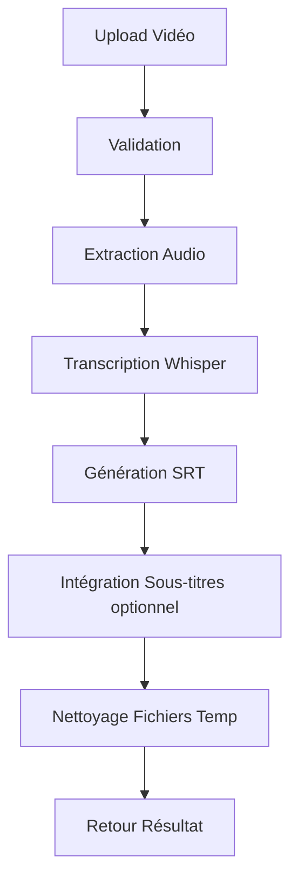

# 🎬 Video Subtitle Generator API

API REST FastAPI pour la génération automatique de sous-titres et leur intégration dans des vidéos en utilisant l'IA Whisper d'OpenAI.

[](https://fastapi.tiangolo.com)
[](https://www.python.org)
[](https://github.com/openai/whisper)

## 📋 Table des matières

- [Vue d'ensemble](#-vue-densemble)
- [Fonctionnalités](#-fonctionnalités)
- [Architecture](#-architecture)
- [Prérequis](#-prérequis)
- [Installation](#-installation)
- [Configuration](#-configuration)
- [Utilisation](#-utilisation)
- [API Endpoints](#-api-endpoints)
- [Structure du projet](#-structure-du-projet)
- [Technologies utilisées](#-technologies-utilisées)
- [Workflow de traitement](#-workflow-de-traitement)
- [Dépannage](#-dépannage)

## 🎯 Vue d'ensemble

Cette application FastAPI offre un service de génération automatique de sous-titres pour vidéos. Elle utilise le modèle Whisper d'OpenAI pour transcrire l'audio en texte et générer des fichiers de sous-titres au format SRT. L'application peut également intégrer ces sous-titres directement dans les vidéos tout en préservant la qualité audio.

### Cas d'usage

- 🎓 **Éducation** : Sous-titrage automatique de cours et conférences
- 🎥 **Production vidéo** : Génération rapide de sous-titres pour contenus multimédia
- 🌍 **Accessibilité** : Rendre les vidéos accessibles aux personnes malentendantes
- 🗣️ **Multilinguisme** : Transcription dans différentes langues

## ✨ Fonctionnalités

- ✅ **Génération automatique de sous-titres** avec Whisper AI
- ✅ **Support multi-langues** avec détection automatique ou spécification manuelle
- ✅ **Plusieurs modèles Whisper** : tiny, base, small, medium, large
- ✅ **Formats vidéo multiples** : MP4, AVI, MOV, MKV, FLV, WMV
- ✅ **Export au format SRT** standardisé
- ✅ **Intégration des sous-titres** dans la vidéo (optionnel)
- ✅ **Préservation de la qualité audio** originale
- ✅ **API REST complète** avec documentation interactive
- ✅ **Gestion des erreurs** robuste avec logging détaillé
- ✅ **Nettoyage automatique** des fichiers temporaires

## 🏗️ Architecture

L'application suit une architecture en couches (layered architecture) :

```
┌─────────────────────────────────────┐
│        FastAPI Application          │
│      (main.py + Routers)            │
└──────────────┬──────────────────────┘
               │
┌──────────────▼──────────────────────┐
│        Business Logic Layer         │
│      (VideoProcessor Service)       │
└──────────────┬──────────────────────┘
               │
       ┌───────┴───────┐
       │               │
┌──────▼────────┐ ┌───▼────────────┐
│ SubtitleService│ │ FFmpegService │
│  (Whisper AI)  │ │ (Vidéo/Audio) │
└────────────────┘ └────────────────┘
```

### Composants principaux

1. **Routes** : Gestion des endpoints HTTP
2. **Services** : Logique métier (traitement vidéo, génération sous-titres)
3. **Models** : Schémas de données (Pydantic)
4. **Config** : Configuration et constantes
5. **Utils** : Fonctions utilitaires (logging, fichiers, timestamps)

## 🔧 Prérequis

### Logiciels requis

- **Python 3.10+**
- **FFmpeg** (pour le traitement audio/vidéo)
- **pip** (gestionnaire de paquets Python)

### Installation FFmpeg

#### Linux (Ubuntu/Debian)
```bash
sudo apt update
sudo apt install ffmpeg
```

#### Linux (Fedora/RHEL)
```bash
sudo dnf install ffmpeg
```

#### macOS
```bash
brew install ffmpeg
```

#### Windows
Télécharger depuis [ffmpeg.org](https://ffmpeg.org/download.html) et ajouter au PATH.

### Vérification de l'installation
```bash
ffmpeg -version
```

## 📦 Installation

### 1. Cloner le projet

```bash
cd /path/to/vidp-app/app_subtitle
```

### 2. Créer un environnement virtuel

```bash
python3 -m venv venv
source venv/bin/activate  # Sur Linux/macOS
# ou
venv\Scripts\activate     # Sur Windows
```

### 3. Installer les dépendances

```bash
pip install -r requirements.txt
```

### Dépendances principales

```
fastapi==0.123.8          # Framework web
uvicorn[standard]==0.38.0 # Serveur ASGI
whisper-openai==1.0.0     # Modèle Whisper
moviepy==2.2.1            # Traitement vidéo
python-multipart==0.0.20  # Upload de fichiers
httpx==0.28.1             # Client HTTP
pydantic==2.12.5          # Validation de données
python-dotenv==1.2.1      # Variables d'environnement
```

## ⚙️ Configuration

### Fichier `config/settings.py`

Les paramètres principaux sont configurés dans `Settings` :

```python
# API Configuration
API_TITLE = "Video Subtitle Generator API"
API_VERSION = "1.0.0"

# Modèles Whisper disponibles
WHISPER_MODELS = ["tiny", "base", "small", "medium", "large"]
DEFAULT_MODEL = "base"

# Formats vidéo supportés
ALLOWED_EXTENSIONS = {'.mp4', '.avi', '.mov', '.mkv', '.flv', '.wmv'}

# Taille maximale des fichiers
MAX_FILE_SIZE_MB = 500

# Répertoires
OUTPUT_DIR = BASE_DIR / "output_videos"
TEMP_DIR = BASE_DIR / "temp"
```

### Variables d'environnement (optionnel)

Créer un fichier `.env` à la racine :

```env
API_PORT=8003
LOG_LEVEL=info
MAX_FILE_SIZE_MB=500
DEFAULT_WHISPER_MODEL=base
```

## 🚀 Utilisation

### Démarrage du serveur

#### Mode développement

```bash
python main.py
```

#### Mode production avec Uvicorn

```bash
uvicorn main:app --host 0.0.0.0 --port 8003 --workers 4
```

#### Avec reload automatique (développement)

```bash
uvicorn main:app --reload --port 8003
```

Le serveur démarre sur : **http://localhost:8003**

### Documentation interactive

- **Swagger UI** : http://localhost:8003/docs
- **ReDoc** : http://localhost:8003/redoc

## 📡 API Endpoints

### 1. Root Endpoint

```http
GET /
```

Retourne les informations générales de l'API.

**Réponse :**
```json
{
  "service": "Video Subtitle Generator API",
  "version": "1.0.0",
  "status": "running",
  "endpoints": {
    "generate_subtitles": "/api/generate-subtitles/",
    "health": "/api/health",
    "info": "/api/info",
    "docs": "/docs"
  }
}
```

### 2. Générer des sous-titres

```http
POST /api/generate-subtitles/
```

Génère des sous-titres pour une vidéo uploadée.

**Paramètres :**
- `video` (file, required) : Fichier vidéo
- `model_name` (string, optional) : Modèle Whisper (défaut: "base")
- `language` (string, optional) : Code langue ISO (ex: "fr", "en")

**Exemple avec cURL :**

```bash
curl -X POST "http://localhost:8003/api/generate-subtitles/" \
  -F "video=@/path/to/video.mp4" \
  -F "model_name=base" \
  -F "language=fr"
```

**Exemple avec Python (httpx) :**

```python
import httpx

with open("video.mp4", "rb") as video_file:
    files = {"video": video_file}
    data = {"model_name": "base", "language": "fr"}
    
    response = httpx.post(
        "http://localhost:8003/api/generate-subtitles/",
        files=files,
        data=data
    )
    
    print(response.text)  # Texte transcrit complet
```

**Réponse :**
```
Texte complet transcrit de la vidéo...
```

### 3. Health Check

```http
GET /api/health
```

Vérifier l'état de santé de l'application.

**Réponse :**
```json
{
  "status": "healthy",
  "service": "Video Subtitle Generator API",
  "timestamp": "2025-12-31T10:30:00",
  "version": "1.0.0",
  "processor_ready": true
}
```

### 4. Informations API

```http
GET /api/info
```

Obtenir des informations détaillées sur l'API.

**Réponse :**
```json
{
  "service": "Video Subtitle Generator API",
  "version": "1.0.0",
  "description": "Automatic subtitle generation and embedding for videos",
  "features": [
    "Automatic subtitle generation using Whisper AI",
    "Support for multiple languages",
    "Subtitle embedding into videos",
    "Multiple Whisper model sizes",
    "Preserves audio quality"
  ],
  "supported_formats": [".avi", ".flv", ".mkv", ".mov", ".mp4", ".wmv"],
  "whisper_models": ["tiny", "base", "small", "medium", "large"]
}
```

### 5. Télécharger les sous-titres

```http
GET /api/download-subtitles/{filename}
```

Télécharger un fichier de sous-titres SRT généré.

**Exemple :**
```bash
curl -O "http://localhost:8003/api/download-subtitles/20251231_abc123_video_subtitles.srt"
```

## 📁 Structure du projet

```
app_subtitle/
│
├── main.py                      # Point d'entrée de l'application
├── requirements.txt             # Dépendances Python
├── README.md                    # Documentation
│
├── config/                      # Configuration
│   ├── __init__.py
│   ├── settings.py             # Paramètres de l'application
│   └── constants.py            # Constantes
│
├── models/                      # Modèles de données
│   ├── __init__.py
│   ├── request_models.py       # Schémas de requêtes
│   └── response_models.py      # Schémas de réponses
│
├── routes/                      # Routes API
│   ├── __init__.py
│   ├── subtitle_routes.py      # Endpoints de sous-titres
│   └── health_routes.py        # Endpoints de santé
│
├── services/                    # Logique métier
│   ├── __init__.py
│   ├── video_processor.py      # Orchestrateur principal
│   ├── subtitle_service.py     # Service Whisper
│   └── ffmpeg_service.py       # Service FFmpeg
│
├── utils/                       # Utilitaires
│   ├── __init__.py
│   ├── logging_config.py       # Configuration logging
│   ├── file_utils.py           # Gestion fichiers
│   └── timestamp_utils.py      # Formatage timestamps
│
├── output_videos/               # Vidéos traitées (généré)
└── temp/                        # Fichiers temporaires (généré)
```

## 🛠️ Technologies utilisées

### Backend

- **[FastAPI](https://fastapi.tiangolo.com/)** - Framework web moderne et performant
- **[Uvicorn](https://www.uvicorn.org/)** - Serveur ASGI haute performance
- **[Pydantic](https://pydantic-docs.helpmanual.io/)** - Validation de données

### IA & Traitement

- **[OpenAI Whisper](https://github.com/openai/whisper)** - Modèle de reconnaissance vocale
- **[MoviePy](https://zulko.github.io/moviepy/)** - Manipulation de vidéos
- **[FFmpeg](https://ffmpeg.org/)** - Traitement audio/vidéo

### Modèles Whisper disponibles

| Modèle   | Paramètres | Taille | Vitesse | Précision |
|----------|-----------|--------|---------|-----------|
| `tiny`   | 39M       | ~75 MB | ⚡⚡⚡⚡⚡ | ⭐⭐      |
| `base`   | 74M       | ~140 MB| ⚡⚡⚡⚡   | ⭐⭐⭐    |
| `small`  | 244M      | ~460 MB| ⚡⚡⚡     | ⭐⭐⭐⭐  |
| `medium` | 769M      | ~1.5 GB| ⚡⚡       | ⭐⭐⭐⭐⭐|
| `large`  | 1550M     | ~3 GB  | ⚡        | ⭐⭐⭐⭐⭐|

**Recommandations :**
- `tiny` / `base` : Tests rapides, prototypage
- `small` : Bon compromis vitesse/qualité
- `medium` / `large` : Production, haute précision

## 🔄 Workflow de traitement



### Étapes détaillées

1. **Upload & Validation**
   - Vérification du format de fichier
   - Contrôle de la taille (max 500 MB)
   - Génération d'un ID unique

2. **Extraction Audio**
   - Conversion en format WAV avec FFmpeg
   - Stockage temporaire

3. **Transcription**
   - Chargement du modèle Whisper
   - Analyse de l'audio
   - Génération des segments avec timestamps

4. **Génération SRT**
   - Formatage au format SubRip (.srt)
   - Encodage UTF-8
   - Sauvegarde dans `temp/`

5. **Intégration (optionnel)**
   - Embedding des sous-titres dans la vidéo
   - Préservation de la qualité audio
   - Export vers `output_videos/`

6. **Nettoyage**
   - Suppression des fichiers temporaires
   - Libération de la mémoire

## 🐛 Dépannage

### Problèmes courants

#### 1. FFmpeg non trouvé

**Erreur :**
```
FileNotFoundError: ffmpeg not found
```

**Solution :**
```bash
# Vérifier l'installation
which ffmpeg

# Installer si nécessaire
sudo apt install ffmpeg
```

#### 2. Mémoire insuffisante

**Erreur :**
```
RuntimeError: CUDA out of memory
```

**Solution :**
- Utiliser un modèle plus petit (`tiny` ou `base`)
- Réduire la taille du fichier vidéo
- Augmenter la RAM/VRAM disponible

#### 3. Format non supporté

**Erreur :**
```
HTTPException: Unsupported file format
```

**Solution :**
- Vérifier les formats supportés : `.mp4`, `.avi`, `.mov`, `.mkv`, `.flv`, `.wmv`
- Convertir la vidéo dans un format compatible

#### 4. Port déjà utilisé

**Erreur :**
```
OSError: [Errno 98] Address already in use
```

**Solution :**
```bash
# Trouver le processus
lsof -i :8003

# Tuer le processus
kill -9 <PID>

# Ou utiliser un autre port
uvicorn main:app --port 8004
```

### Logs

Les logs sont enregistrés uniquement dans la **console** (stdout/stderr) pour faciliter l'intégration avec des systèmes de logging centralisés en production.

Pour activer les logs détaillés :
```bash
uvicorn main:app --log-level debug
```

> 💡 **Astuce** : En production, redirigez la sortie vers un système de logging comme ELK, Loki, ou CloudWatch.

## 📊 Performance

### Temps de traitement estimés (vidéo 1 minute)

| Modèle  | CPU (8 cores) | GPU (CUDA) |
|---------|---------------|------------|
| tiny    | ~15s          | ~5s        |
| base    | ~30s          | ~8s        |
| small   | ~60s          | ~15s       |
| medium  | ~120s         | ~30s       |
| large   | ~180s         | ~45s       |

*Temps approximatifs, varient selon le matériel*

## 🔒 Sécurité

### Recommandations pour la production

1. **CORS** : Restreindre les origines autorisées
   ```python
   allow_origins=["https://yourdomain.com"]
   ```

2. **Authentification** : Ajouter des tokens/API keys
3. **Rate limiting** : Limiter le nombre de requêtes
4. **HTTPS** : Utiliser un reverse proxy (Nginx, Traefik)
5. **Validation** : Vérifier l'intégrité des fichiers uploadés
